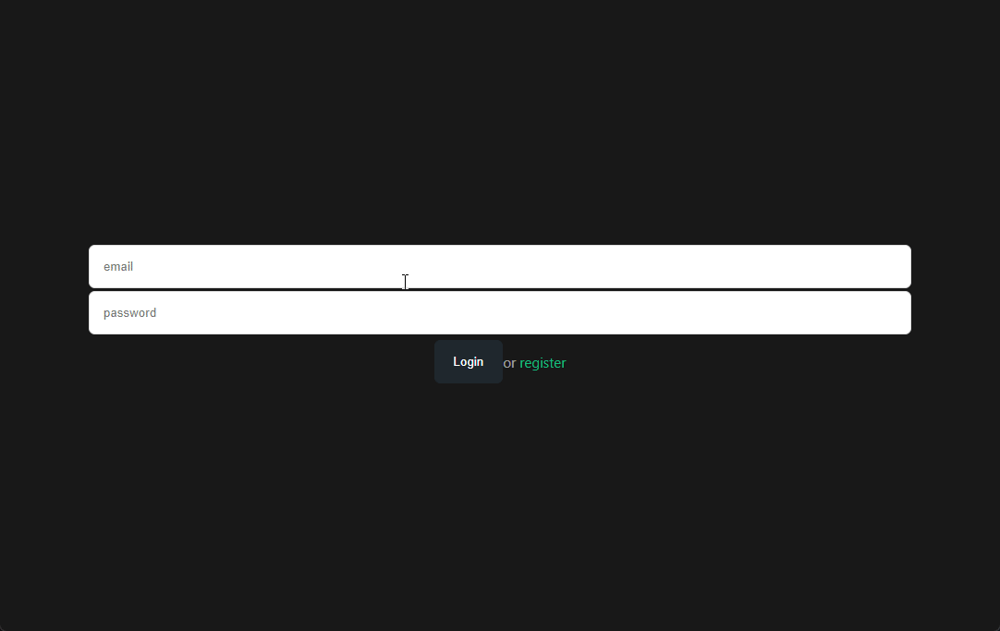

# Basic to-do app with nest js and vue3

## Run

Use docker compose to run this app.

Under project base directory you can run `docker-compose up -d`

> if you want to change configs you can use dotenv files under project directories such as `/ui/.env` . Otherwise app will use default dotenv files.

## Usage

### Register

Under `/login` page click register and fill the form.

### Creating groups

Click "Add new" button under "To-do groups" which is located in home page `/` and fill and submit the form.

### Creating todo

You can use either  group page or home page to add new todo. Click "Add new" button under todo list and fill the form.

> You have to select todo group if you are trying to add on home page.

## Swagger

You can reach the swagger doc under `/api`
